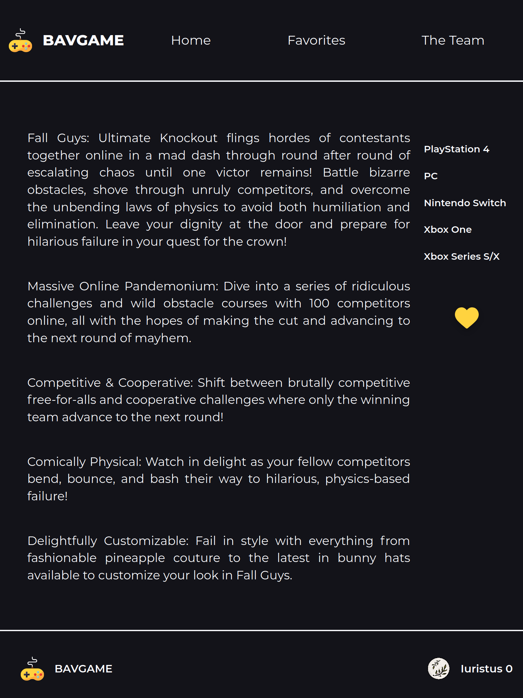

# Js Project

### Demarrer le serveur dans un mode 'developement' :

1. Version: écrire des commandes c'est mon dada:
   ```sh
   $- npm install
   $- npm run watch
   # Dans un autre terminal
   $- npx serve -s -l 8000
   ```
2. Version: j'ai pas ton temps dépêche toi: (Linux)
   ```sh
   $- npm run profDev
   ```

### Demarrer le serveur dans un mode 'production' :

1. Version: écrire des commandes c'est mon dada:
   ```sh
   $- npm install
   $- npm run build
   # Dans un autre terminal
   $- npx serve -s -l 8000
   ```
2. Version: j'ai pas ton temps dépêche toi: (Linux)
   ```sh
   $- npm run prof
   ```

### Verifications des test jest:

1. Une seule commande:
   ```sh
   $- npm run test
   ```

### URL de l'environement de production

L'application est deploye sur netlify et accessible a cette url: [bavgame](https://bavgame.netlify.app)

### Screenshot de la SPA:

#### Version 'ordinateur':
1. **HomePage**:
   
   
2. **DetailPage**:
   
3. **FavoritePage**:
   
4. **TeamPage**:
   
5. **404 Page**:
   
   

#### Version responsive:

1. **HomePage**:
   <div style="display: flex; flex-direction:row; align-items:center;justify-content:space-around; flex-wrap: wrap">
      
      
      
   </div>

2. **DetailPage**:
   <div style="display: flex; flex-direction:row; align-items:center;justify-content:space-around; flex-wrap: wrap; margin: 5px">
      
      
      
   </div>
   
   
   

3. **FavoritePage**:
   <div style="display: flex; flex-direction:row; align-items:center;justify-content:space-around; flex-wrap: wrap; margin: 5px">
      
      
   </div>

4. **TeamPage**:
  <div style="display: flex; flex-direction:row; align-items:center;justify-content:space-around; flex-wrap: wrap; margin: 5px">
      
      
      
   </div>

5. **404 Page**:
  <div style="display: flex; flex-direction:row; align-items:center;justify-content:space-around; flex-wrap: wrap; margin: 5px">
      
      
   </div>

## TODOLIST
Voir le fichier [TODOLIST.md](./TODOLIST.md)
