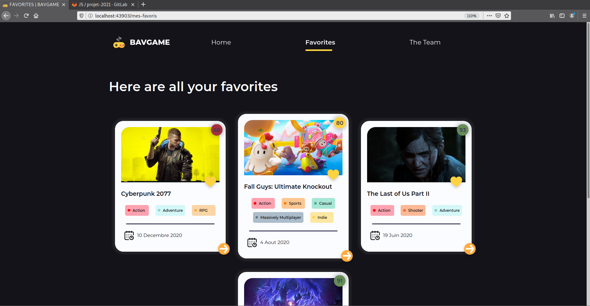

# Js Project

### Demarer le server dans un mode development :

1. Version: écrire des commandes c'est mon dada:
   ```sh
   $- npm install
   $- npm run watch
   # Dans un autre terminal
   $- npx serve -s -l 8000
   ```
2. Version: j'ai pas ton temps dépêche toi:
   ```sh
   $- npm run profDev
   ```
### Demarer le server dans un mode production :

1. Version: écrire des commandes c'est mon dada:
   ```sh
   $- npm install
   $- npm run build
   # Dans un autre terminal
   $- npx serve -s -l 8000
   ```
2. Version: j'ai pas ton temps dépêche toi:
   ```sh
   $- npm run prof
   ```

### Verifications des test jest:

1. Une seule commande:
   ```sh
   $- npm run test
   ```

### Screenshot de la SPA:





## Bonus: des meme de l'equipe


